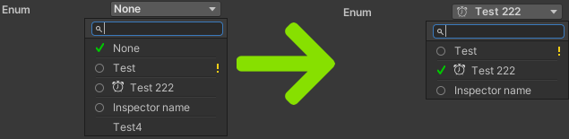

# Unflag enum attribute for Odin

This attribute limits choice to only one single bit value from enum with `Flags` attribute

## Instalation

Put `UnflagEnum` folder into Unity project

## Usage

Just add `UnflagEnum` attribute to enum field or property